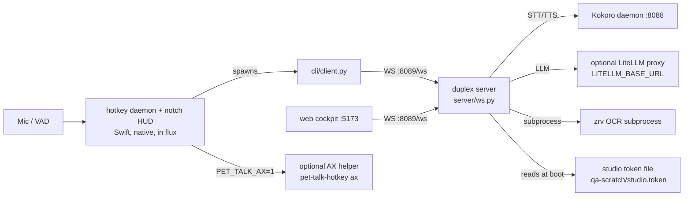

## Purpose

pet-talk is a local-first, full-duplex voice agent: a duplex server, a native macOS hotkey/HUD daemon, a terminal CLI, and a web cockpit, wired to swappable STT/LLM/TTS providers. It is used from the terminal (`cli/client.py`), from anywhere on macOS via a global hotkey, or from the browser cockpit. It is not a video pipeline, not a cloud service, and not a chat app with no barge-in — the wire contract exists specifically to let the user cut the agent off mid-sentence.

## System diagram



```
MIC/VAD --> [hotkey daemon :HUD] --> cli/client.py --+
                                                       |
                             web cockpit :5173 -------+--> WS :8089/ws --> server (ws.py/turn.py)
                                                                              |-- STT/TTS --> Kokoro :8088
                                                                              |-- LLM ------> LiteLLM proxy (optional)
                                                                              |-- OCR ------> zrv subprocess
hotkey daemon --(PET_TALK_AX=1)--> pet-talk-hotkey ax (optional AX helper, NOT YET WIRED, see gaps)
server reads studio token from .qa-scratch/studio.token at boot
```

## Components

| Component | File/dir | Job | Interface it exposes |
| --- | --- | --- | --- |
| Duplex server | `server/app.py` (composer), `server/ws.py`, `server/turn.py` | Full-duplex voice loop over WS, one `Session` per socket | WS `/ws`, HTTP routes below, port 8089 |
| Runtime/settings | `server/runtime.py`, `server/settings.py`, `server/provider_factory.py` | Live provider triple, swap lock, config-only provider changes | `GET/POST /settings` |
| Speech pipeline | `server/speech.py`, `server/speak_queue.py`, `server/stall.py` | LLM producer + TTS consumer, cached stall audio | internal, drives `agent.sentence`/`agent.stall` frames |
| Control | `server/control.py` | Deterministic stop/status/identity, no LLM round trip | internal turn router |
| Grounding | `server/grounding.py` | Repo-head lines + optional AX snapshot into system prompt | shells `pet-talk-hotkey ax` when `PET_TALK_AX=1` |
| Eyes (zero-vision) | `server/eyes.py` | Local OCR of attached image/PDF via `zrv` | `user.attach` -> `eyes.received`/`eyes.text` |
| Auth | `server/auth.py` | Studio token check, egress allowlist | header `X-Studio-Token` / `?token=` |
| Persona | `server/persona.py`, `server/persona_runtime.py`, `server/voices.py` | Load/save personas, resolve system prompt + voice | `GET/POST/DELETE /personas` |
| Memory | `server/memory.py`, `server/audio_store.py`, `server/telemetry.py` | Turn ledger, bounded WAV cache, per-turn JSONL telemetry | `GET /ledger`, `GET /audio/{id}` |
| Providers | `server/providers/*.py` | STT/LLM/TTS/VAD backends, one factory each | see Interfaces |
| CLI client | `cli/client.py` | Terminal voice/text client, mic capture, playback | `pet-talk-cli [interactive\|once\|tui]` |
| Hotkey daemon + HUD | `cli/hotkey/*.swift` (in flux — a concurrent lane may still be editing these) | Global Option+Tab hotkey, notch HUD, earcons, paste injection | `pet-talk-hotkey <subcommand>`, described below |
| Web cockpit | `web/src` (Vite/React) | Browser UI: settings, persona studio, memory drawer, eyes attach | connects to WS `/ws`, port 5173 |

## Interfaces

### WS frames (`server/ws.py`, `server/frames.py`)

Full frame catalogue and every `agent.error` reason are the contract in `docs/SPEC.md` §4 — do not duplicate the table here, only the type names:

- Client to server: `user.start`, `user.chunk`, `user.stop`, `user.text`, `user.attach`, `barge`.
- Server to client: `state.idle`/`state.listening`/`state.thinking`/`state.speaking`, `transcript.user`, `agent.stall`, `agent.sentence`, `agent.done`, `agent.error`, `eyes.received`, `eyes.text`.

### HTTP routes (`server/routes_http.py`)

| Route | Method | Auth required |
| --- | --- | --- |
| `/health` | GET | no |
| `/voices` | GET | no |
| `/personas` | GET | no |
| `/personas` | POST/DELETE | yes (`X-Studio-Token`) |
| `/settings` | GET | no (redacted) |
| `/settings` | POST | yes |
| `/ledger` | GET | no |
| `/ledger` | DELETE | yes |
| `/transcribe` | POST | yes |
| `/audio/{id}` | GET | no |
| `/ws` | WS upgrade | yes (`X-Studio-Token` header or `?token=`) |

### Provider methods (`server/providers/*.py`)

```
STTProvider.transcribe(pcm16_bytes: bytes, sample_rate: int = 16000) -> str
LLMProvider.route(text: str) -> "stall" | "answer"
LLMProvider.stream(messages: list[dict]) -> AsyncIterator[str]
TTSProvider.synth(text: str, voice: str, speed: float) -> tuple[bytes, list[dict]]
```

### Makefile targets

| Target | Runs |
| --- | --- |
| `make build-hotkey` | `cli/hotkey/build.sh bin/` on `ssh air` (script owned by another lane; does not build locally) |
| `make qa` | `bash qa/run_all.sh` |
| `make qa-silent` | `PET_TALK_SILENT=1 bash qa/run_all.sh` |
| `make qa-real` | `PET_TALK_REAL_ENGINE=1 bash qa/run_all.sh` |

### CLI subcommands

`pet-talk-cli [interactive|once|tui]` (`cli/client.py`), flags: `--hotkey`/`-1`, `--url`, `--persona`, `--vad`, `--silence`, `--threshold`, `--quiet`/`-q`.

- 2026-09-12: `PET_TALK_AX=1` grounding is wired end to end in code (`server/grounding.py` calls `pet-talk-hotkey ax`, implemented in `cli/hotkey/main.swift`), built locally 2026-09-12 (`make build-hotkey`, 8 s); without the Accessibility grant `ax` returns `ax_permission_denied` as designed. The grounding line in a real turn is still unverified.

### Env vars (grepped from `os.environ.get`/`os.getenv` across `server/`)

| Var | Default | Used by |
| --- | --- | --- |
| `STUDIO_TOKEN` | generated at boot into `.qa-scratch/studio.token` | `auth.py` |
| `STUDIO_TOKEN_FILE` | — | `auth.py` |
| `PET_TALK_ALLOWED_HOSTS` | — | `auth.py` egress allowlist |
| `DEFAULT_PERSONA` | `donna` (`DEFAULT_PERSONA_NAME`) | `runtime.py` |
| `PET_TALK_LOG_LEVEL` | `INFO` | `logs.py` |
| `PET_TALK_CORS_ORIGINS` | `DEFAULT_CORS_ORIGINS` | `app.py` |
| `PET_TALK_STALL_CACHE_MAX` | `DEFAULT_STALL_CACHE_MAX` | `stall.py` |
| `GROQ_API_KEY`, `ANTHROPIC_API_KEY`, `DEEPGRAM_API_KEY`, `SMALLEST_API_KEY`, `OPENAI_API_KEY` | — | `settings.py` defaults / provider selection |
| `LLM_PROVIDER`, `STT_PROVIDER`, `TTS_PROVIDER` | `litellm`, `faster-whisper`, `kokoro-local` — all three chosen on measurement 2026-09-12b, and no longer conditional on which key happens to be in the environment | `settings.py`, `provider_factory.py` |
| `OPENCODE_GO_KEY`/`OPENCODE_LENOVO_KEY`/`OPENCODE_API_KEY` | — | `settings.py` opencode LLM key chain |
| `GEMINI_PRIMARY_API_KEY`/`GOOGLE_API_KEY` | — | `settings.py` gemini LLM key chain |
| `VAD_SILENCE_MS` | `600` | `settings.py` |
| `LLM_API_KEY` | falls back to `settings.key_for_llm()` | `settings.py` |
| `PET_TALK_TURN_DELAY_MS` | `0` | `speech.py` |
| `PET_TALK_AX` | off | `grounding.py` (gates AX helper shellout) |
| `PET_TALK_GROUNDING_REPOS` | empty (colon-separated) | `grounding.py` |
| `EYES_ENGINE` | `zrv` | `eyes.py` |
| `EYES_ENGINE_PIN` | — | `eyes.py` |
| `EYES_DESCRIBE_ENGINE` | unset (describe disabled by default) | `eyes.py` |
| `EYES_ZRV_BIN` | `zrv` | `eyes.py` |
| `EYES_DEFAULT_TASK` | `transcribe` | `eyes.py` |
| `EYES_SCRATCH_DIR` | system temp dir | `eyes.py` |
| `PET_TALK_DICTATION` | off | `eyes.py` |
| `KOKORO_TIMEOUT_S` | `15` | `providers/tts.py` |
| `SPACEPILOT_TOKEN`/`STUDIO_TOKEN`/`KOKORO_TOKEN` | — | `providers/tts.py` Kokoro auth chain |
| `KOKORO_BASE_URL` | `http://127.0.0.1:8088` | `providers/tts.py` |
| `ELEVENLABS_API_KEY`, `SMALLEST_API_KEY`, `DEEPGRAM_API_KEY` | — | `providers/tts.py` backends |
| `LITELLM_BASE_URL` | `http://127.0.0.1:4000/v1` | `providers/llm.py` |
| `ANTHROPIC_BASE_URL`, `HAIKU_MODEL` | `claude-3-5-haiku-20241022` | `providers/llm.py` |
| `OPENCODE_BASE_URL`/`OPENCODE_MODEL` | `https://api.opencode.ai/v1` / `flash-3.8` | `providers/llm.py` |
| `GEMINI_BASE_URL`/`GEMINI_MODEL` | `.../v1beta/openai` / `gemini-2.5-flash` | `providers/llm.py` |
| `OPENAI_BASE_URL`/`OPENAI_MODEL` | `https://api.openai.com/v1` / `gpt-5-nano` | `providers/llm.py` |
| `LLM_BASE_URL`/`LLM_MODEL` | `DEFAULT_LITELLM_BASE_URL` / `claude-sonnet-4-6` | `providers/llm.py` |
| `LITELLM_MASTER_KEY` | — | `providers/llm.py` fallback key |
| `GROQ_BASE_URL` | Groq default | `providers/stt.py`, `providers/llm.py` |
| `WHISPERKIT_CLI_PATH` | `whisperkit-cli` | `providers/stt.py` |
| `WHISPER_MODEL` | `tiny.en` | `providers/stt.py` |
| `SENSEVOICE_BASE_URL` | `http://127.0.0.1:8086` | `providers/stt.py` |
| `PET_TALK_WS_URL` | `ws://127.0.0.1:8089/ws` | `cli/client.py` |
| `PET_TALK_PERSONA` | `donna` | `cli/client.py` |
| `PET_TALK_VAD_SILENCE_MS` | `800` | `cli/client.py` |
| `PET_TALK_VAD_THRESHOLD` | `350.0` | `cli/client.py` |
| `VITE_WS_URL` | `ws://127.0.0.1:8089/ws` | `web/src/ws.ts` |
| `VITE_STUDIO_TOKEN` | — | `web/src/ws.ts` |
| `PET_TALK_SILENT` | off | night-mode gate, `qa/run_all.sh` and AGENTS.md law 7 |
| `PET_TALK_REAL_ENGINE` | off | `make qa-real` |

## Data & state

- **Turn ledger**: `server/ledger.jsonl` (append-only, via `memory.py`) — every turn's text, never audio.
- **Telemetry**: `server/turns.jsonl` (via `telemetry.py`) — one JSONL row per turn with stage timing marks.
- **Audio**: bounded in-memory store (`audio_store.py`), never written to disk; served at `/audio/{id}` until evicted.
- **Studio token**: generated once at boot into `.qa-scratch/studio.token` (0600, gitignored) if `STUDIO_TOKEN`/`STUDIO_TOKEN_FILE` are unset.
- **Personas**: `personas/*.md` frontmatter + `voices.yaml`, read/written by `persona.py`.
- **Web cockpit token**: browser `localStorage` (`web/src/ws.ts`), falls back to `VITE_STUDIO_TOKEN` at build time; survives a reload only via `localStorage`.
- **Never stored**: secrets in the repo tree (Doppler/env only, AGENTS.md law 3); pixels or vision tokens for eyes attachments — OCR text only leaves `eyes.py`, the image/PDF bytes are decoded to a scratch dir (`EYES_SCRATCH_DIR`, outside the repo) and not persisted after OCR.

## Cross-product edges

| Other product | Direction | Mechanism | Contract file |
| --- | --- | --- | --- |
| zero-vision (zrv) | pet-talk calls out | `server/eyes.py` shells the `zrv` CLI for local OCR (`--engine apple-vision` etc.) | `docs/SPEC.md` §8 |
| realengine | none | — | — |
| SpacePilot | pet-talk calls out (optional) | Kokoro TTS daemon auth token can be `SPACEPILOT_TOKEN` (`providers/tts.py`) | — |

## Invariants

Numbered from `AGENTS.md`'s seven laws:

1. Fail closed with named reasons, no silent fallbacks — enforced by the `agent.error` reason catalogue (`docs/SPEC.md` §4.3) and `qa/test_protocol.py`, `qa/test_providers.py`.
2. Provider swaps are config-only — enforced by `qa/test_providers.py`, `qa/test_settings_api.py`.
3. No absolute paths, no secrets in tree — unenforced by an automated check in this checkout; `qa/test_security.py` covers token/secret redaction but not a repo-wide path/secret scan.
4. Heavy compute leaves the MacBook — unenforced by code; a process convention (`make build-hotkey` shells to `ssh air`), not checked by `qa/`.
5. Subagents report back in one message, never spawn sideways — a process rule, not a code invariant; unenforced by `qa/`.
6. Taste (persona character) is human-approved, tone changes are PRs — a process rule; unenforced by `qa/`.
7. Night mode `PET_TALK_SILENT=1` — nothing plays audio or starts an audio daemon — enforced by `qa/run_all.sh`'s `SILENT`-tagged suites (skip under the flag) per AGENTS.md; cross-check `qa/test_earcons.py`, `qa/test_hud.py`.

Latency budgets (`qa/budgets.json`), each mapped to its gate per `docs/SPEC.md` §9.2: stall ≤400ms (`qa/latency.py`, `qa/test_turn_lifecycle.py`), barge ≤100ms (`qa/latency.py`, `qa/test_turn_lifecycle.py`, `qa/test_socket_resilience.py`), turn p50 ≤800ms / worst ≤1200ms (`qa/latency.py`), provider swap zero-code-change (`qa/test_providers.py`, `qa/test_settings_api.py`), persona switch isolation (`qa/test_persona.py`, `qa/test_persona_api.py`). Turn-level budgets are measured against real providers as of 2026-09-12b and all three hold; `tts_ms` and cold-start `turn_worst_ms` do not — see `docs/SPEC.md` §9.1 and Known gaps.

## Known gaps

From `docs/SPEC.md` §10, plus what this pass found:

- 2026-09-12b: **real-engine turn latency is measured, and the turn-level budgets hold.** Live WS through the real loop with real speech: `stall_ms` 245.5ms p50 (budget 400, PASS), `first_sentence_ms` 245.5ms p50 (budget 800, PASS), `barge_ms` 0.9ms p50 (budget 100, PASS). Full table and method in `docs/SPEC.md` §9.1.
- 2026-09-12b (fixed this pass): the previous entry here claimed `groq/compound-mini` "cannot stream text". Wrong diagnosis. A reasoning model spends its token ceiling on `reasoning` deltas before it writes any `content`, and the ordinary 120-token ceiling ran out first — `finish_reason: "length"`, nothing spoken. Reproduced on `openai/gpt-oss-20b` and `qwen/qwen3.6-27b` as well. `_build_payload` now floors the ceiling at 400 for that family and sends `reasoning_effort: "low"` to gpt-oss; `_sentence_stream` raises `llm_no_content` instead of returning an empty generator, so this failure can never again look like a healthy provider.
- 2026-09-12b (fixed this pass): `qa/latency.py` sent 320 samples of silence at the turn. Harmless against stub STT, fatal against a real tyre — it transcribed to nothing, the turn ended in `empty_transcript`, and every turn-level number it printed was the error path. Both live-turn scripts now share one fixture resolver (`qa/fixture_audio.py`) and send real speech with its true sample rate.
- 2026-09-12b: **`tts_ms` still FAILs — 236.6ms against 200ms**, down from 1285.9ms. The gap that remains is structural: Kokoro's RTF here is ~0.06 and `agent.sentence` carries one finished WAV, so any sentence past ~9 words is over budget by construction. Chunked synthesis is the fix and it changes the wire contract. `stt_ms` now PASSES at 143.4ms (was 298.5ms) by going local and tuned rather than cloud.
- 2026-09-12b: the stall cache is cold on the first turn of a fresh process, which is the only reason `turn_worst_ms` breaches (1455.3ms cold, 291.2ms warm). `KokoroLocalTTS` warms its model at startup; nothing warms the persona's stall phrases yet.
- 2026-09-12b: `kokoro-local` needs `mlx-audio` + `misaki[en]`, which on this machine live in `~/miniconda3/envs/local-ml-py311` and not in the base env. A server booted with the base `python3` gets a named `tts_mlx_audio_not_installed` on first synth. Apple Silicon only.
- 2026-09-12 (fixed this pass): every `urllib.request`-based provider call (`server/providers/stt.py`, `server/providers/tts.py`) sent no `User-Agent`, and Cloudflare's WAF in front of `api.groq.com`'s transcription endpoint blocks Python's default UA with a 403 (measured: identical request succeeds with any ordinary UA). Fixed with a shared `DEFAULT_USER_AGENT` constant (`server/providers/_shared.py`) applied to every such request.
- 2026-09-12: the speak queue is per-socket, not per-turn (`Session.queue` reused via `reopen()`); at most one live turn per socket by design.
- 2026-09-12: gate 3 (≥3 gapless sentences) only partially exercised — `StubLLM` hardcodes 3 sentences, nothing proves buffering past 4-5 under sustained pressure.
- 2026-09-12: PDF OCR (`eyes.py`, `pdf_max_pages=5`) has no test fixture with a real PDF.
- 2026-09-12: Kokoro word timings are always estimated (`estimated: true`), never measured per-word.
- 2026-09-12: `cli/hotkey/build.sh` does not exist yet in this checkout; `make build-hotkey` fails until another lane lands it.
- 2026-09-12 (found this pass): `server/grounding.py` shells `pet-talk-hotkey ax` for AX snapshots, but `cli/hotkey/main.swift`'s command dispatch has no `"ax"` case as of commit `97cdd69` — an unrecognized `ax` argument falls through to the default foreground-listener branch, not a JSON snapshot. `PET_TALK_AX=1` grounding likely does not work end-to-end yet; the Swift lane may still be landing this.
- 2026-09-12 (found this pass): cockpit token UX is minimal — `web/src/ws.ts` reads `VITE_STUDIO_TOKEN` or `localStorage`, but there is no visible flow in `web/src/components/SettingsModal.tsx` confirmed in this pass for a first-run user to discover and paste the generated `.qa-scratch/studio.token` value; verify before calling this solved.

## Changelog

| Version | Date | Change | Commit |
| --- | --- | --- | --- |
| 1.0.0 | 2026-09-12 | First ARCHITECTURE.md written against the restructured `server/`, `providers/` package, and current SPEC.md contract | 97cdd69 |
