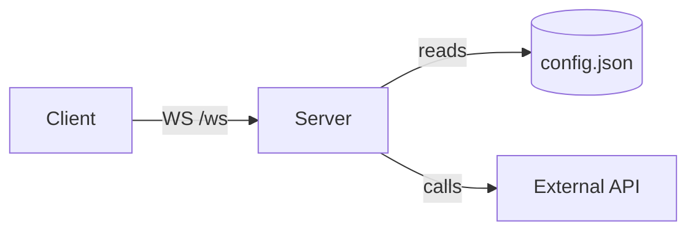

## Purpose

Fixture product exercises every markdown construct the renderer supports.
It is not a real product. It is used only to test `docs/site/build.py`.

## System diagram



```
+--------+   ws   +--------+   calls   +-----------+
| Client | -----> | Server | --------> | External  |
+--------+        +--------+           | API       |
                       |                +-----------+
                       v
                  +----------+
                  | config   |
                  | .json    |
                  +----------+
```

## Components

| Component | File/dir | Job | Interface |
| --- | :---: | --- | ---: |
| Server | `server/app.py` | Runs the WS loop | `/ws` |
| Config loader | `server/config.py` | Loads `config.json` | none |

## Interfaces

| Name | Shape | Consumer |
| --- | --- | --- |
| `/ws` | WebSocket, JSON frames `{type, data}` | web client |
| `--verbose` | CLI flag, boolean | operators |

Some inline code like `server/app.py` and a [link to the repo](https://example.com/repo) plus **bold** and *italic* text and a nested reference: see `config.json`.

## Data & state

- Session state: kept in memory, never persisted.
- Nested list example:
  - sub-item one
  - sub-item two
    - sub-sub-item
- Config: read from `config.json` at startup.

## Cross-product edges

| Other product | Direction | Mechanism | Contract file |
| --- | --- | --- | --- |
| none | n/a | n/a | n/a |

## Invariants

1. The server never blocks the event loop for more than 50ms — enforced by `qa/test_latency.py`.
2. Config is read-only at runtime — unenforced.

## Known gaps

- No retry logic on the external API call (2026-09-01).
- No task list yet:
  - [ ] add retry logic — why it matters — done when: three consecutive failures trigger backoff
  - [x] write this fixture — why it matters — done when: build.py renders it

> This is a blockquote note: fixture content only, not a real architectural claim.

## Changelog

| Version | Date | Change | Commit |
| --- | --- | --- | --- |
| 1.0.0 | 2026-09-12 | Initial fixture | abc1234 |
